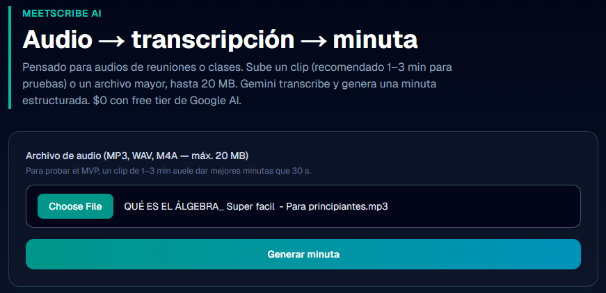
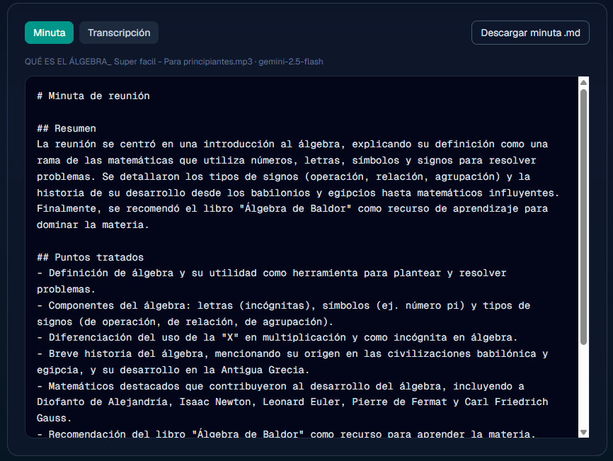
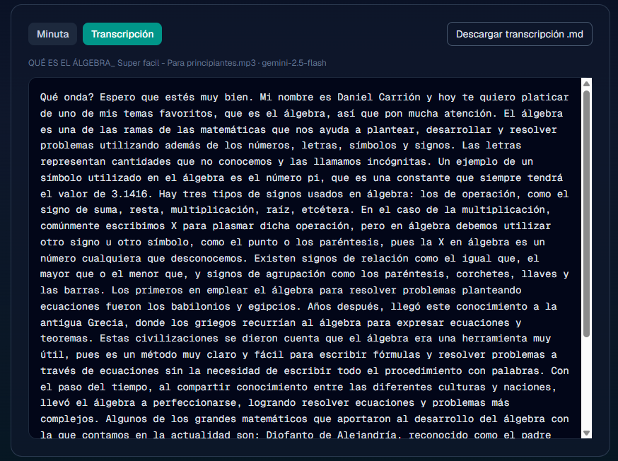

# MeetScribe AI

Web app para convertir **audios de reuniones o clases** en **transcripción** y **minuta estructurada** usando **Gemini API** (free tier — $0).

Pensada para ese tipo de contenido; el MVP acepta archivos de **cualquier duración hasta 20 MB** y fue **validado con clips de prueba de 30 s a 3 min** (ideal para demos y cuota free tier).

**Demo en vivo:** [meetscribe-ai-nu.vercel.app](https://meetscribe-ai-nu.vercel.app)  
**Repositorio:** [github.com/ElBarSimson9593/meetscribe-ai](https://github.com/ElBarSimson9593/meetscribe-ai)

> Next.js · TypeScript · Tailwind · Google Gemini



## Qué hace

1. Subes un archivo de audio (MP3, WAV, M4A…).
2. Gemini transcribe el contenido al español.
3. Gemini genera una minuta Markdown con resumen, puntos, compromisos y decisiones.
4. Descargas el resultado como `.md`.

## Demo en vivo

Prueba la app desplegada en Vercel (requiere `GEMINI_API_KEY` configurada en el proyecto):

**[https://meetscribe-ai-nu.vercel.app](https://meetscribe-ai-nu.vercel.app)**

## Demo local

```bash
cp .env.example .env.local
# Pega tu GEMINI_API_KEY de https://aistudio.google.com/apikey

npm install
npm run dev
```

Abre **http://localhost:3000**

## Variables de entorno

| Variable | Descripción |
|----------|-------------|
| `GEMINI_API_KEY` | API key de Google AI Studio |

## API

```http
POST /api/meetscribe
Content-Type: multipart/form-data

audio: <archivo>
```

Respuesta:

```json
{
  "fileName": "reunion.mp3",
  "transcription": "...",
  "minutes": "# Minuta de reunión\n...",
  "model": "gemini-2.5-flash"
}
```

## Stack

- Next.js App Router
- Tailwind CSS
- `@google/generative-ai` (Gemini 2.5 Flash)

## Límites MVP

- Máximo **20 MB** por archivo (sin límite mínimo de duración)
- **Pruebas del MVP:** clips de 30 s–3 min; audios más largos son posibles pero consumen más cuota de Gemini
- Free tier Gemini: usa un modelo activo (`gemini-2.5-flash`); modelos deprecados pueden fallar con errores confusos

## Evidencia de demo

Demostración con clip educativo (~2 min) procesado con **gemini-2.5-flash**.

Índice completo: [docs/evidence/README.md](docs/evidence/README.md) · Salida textual: [sample-demo-algebra.md](docs/evidence/sample-demo-algebra.md)

### 1. Subir audio

Formulario principal: el usuario selecciona un MP3 y dispara el análisis con Gemini.


### 2. Minuta generada

Resultado estructurado en Markdown: resumen, puntos tratados, compromisos y decisiones.



### 3. Transcripción completa

Texto literal del audio, con opción de descargar como `.md`.



## Autor

**Osvaldo Andrés Díaz Guzmán** — Backend e IA aplicada

## Proyecto relacionado

[SentimentTrend Bot](https://github.com/ElBarSimson9593/sentiment-trend-bot) — API FastAPI de monitoreo de reputación con IA
